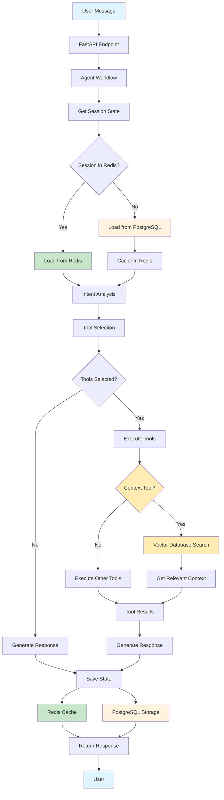
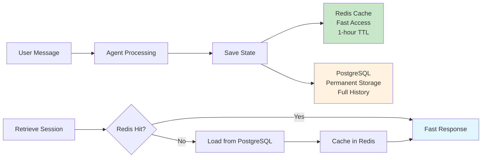

# Agent with Context

A powerful AI agent system built with render_relay framework, featuring Redis state management, PostgreSQL + pgvector for context storage, Google Gemini LLM integration via LangChain, and Pydantic models.

## Features

- 🤖 **AI Agent Conversations** - Stateful conversations with LLM integration
- 🗄️ **Redis State Management** - Fast session access with write-through persistence
- 🧠 **Vector Database Context** - PostgreSQL + pgvector for semantic context storage
- 🔧 **Gemini LLM Integration** - Google's Gemini model via LangChain with Pydantic
- 📊 **Health Monitoring** - Service health checks and diagnostics
- 🚀 **render_relay Framework** - FastAPI + React with hot reloading
- 🔄 **Alembic Migrations** - Version-controlled database schema management

## Quick Start

### 1. Environment Setup

Create a `.env` file with your configuration:

```bash
# Redis Configuration
REDIS_URL=redis://localhost:6379

# PostgreSQL + pgvector Configuration
POSTGRES_HOST=localhost
POSTGRES_PORT=5432
POSTGRES_USER=agent_user
POSTGRES_PASSWORD=agent_password
POSTGRES_DB=agent_context

# Gemini Configuration
GEMINI_API_KEY=your_gemini_api_key_here

# Optional: Customize settings
GEMINI_MODEL=gemini-2.5-flash-lite
GEMINI_TEMPERATURE=0.7
MAX_CONTEXT_LENGTH=2048
CONTEXT_CHUNK_SIZE=1000
CONTEXT_CHUNK_OVERLAP=200
```

### 2. Start Services

```bash
# Start Redis and PostgreSQL with pgvector
docker-compose up -d

# Install dependencies
pip install -r requirements.txt

# Apply database migrations
alembic upgrade head

# Start the application
npm run dev
```

### 3. Test the System

#### Health Check
```bash
curl http://localhost:5001/api/health
```

#### Redis Test
```bash
curl http://localhost:5001/api/redis_test
```

#### Vector Database Test
```bash
curl http://localhost:5001/api/vector_test
```

#### LLM Test
```bash
curl -X POST http://localhost:5001/api/llm_test \
  -H "Content-Type: application/json" \
  -d '{"message": "Hello, how are you?"}'
```

#### Create Agent Session
```bash
curl -X POST http://localhost:5001/api/agent/chat \
  -H "Content-Type: application/json" \
  -d '{"message": "Hello, I need help with a project"}'
```

#### Send Message to Agent
```bash
curl -X POST http://localhost:5001/api/agent/chat \
  -H "Content-Type: application/json" \
  -d '{"session_id": "your-session-id", "message": "Can you help me with Python?"}'
```

## How the Agent Works

### Agent Behavior & Workflow

The agent follows a sophisticated workflow powered by LangGraph:

1. **Message Reception**: User message is received and session is validated
2. **Intent Analysis**: LLM analyzes the message to determine user intent
3. **Tool Selection**: Based on intent, relevant tools are selected
4. **Context Retrieval**: Semantic search finds relevant context from vector database
5. **Tool Execution**: Selected tools are executed with context
6. **Response Generation**: LLM generates response using tool results and context
7. **State Persistence**: Conversation state is saved to Redis and PostgreSQL

### Data Flow Architecture



#### Detailed Data Flow:

1. **Request Processing**
   - User sends message via API
   - FastAPI validates request and extracts session ID
   - Agent workflow is triggered

2. **Session State Retrieval**
   - **Redis Check**: First tries to get session from Redis (fast)
   - **PostgreSQL Fallback**: If Redis miss, loads from PostgreSQL (persistent)
   - **Redis Caching**: Loaded data is cached back to Redis for future access

3. **Agent Processing**
   - **Intent Analysis**: LLM determines what the user wants
   - **Tool Selection**: Based on intent, relevant tools are chosen
   - **Tool Execution**: 
     - If context tool is selected → Vector database search for relevant context
     - If other tools are selected → Execute those tools directly
     - If no tools needed → Skip to response generation
   - **Response Generation**: LLM creates response using tool results and context

4. **State Persistence (Write-Through)**
   - **Redis**: Fast cache with 1-hour TTL for active sessions
   - **PostgreSQL**: Permanent storage for all conversations
   - **Automatic Sync**: Every update goes to both systems simultaneously

5. **Response Delivery**
   - Final response is returned to user
   - Session state is updated in both Redis and PostgreSQL

## Database Migrations

This project uses Alembic for database migrations.

### Initial Setup
```bash
# Initialize Alembic (first time only)
python scripts/migrate.py init

# Apply all migrations
python scripts/migrate.py upgrade
```

### Development Workflow
```bash
# Create a new migration after model changes
python scripts/migrate.py create "Add new feature"

# Apply migrations
python scripts/migrate.py upgrade

# Rollback last migration
python scripts/migrate.py downgrade

# Check current migration
python scripts/migrate.py current

# View migration history
python scripts/migrate.py history
```

### Manual Alembic Commands
```bash
# Generate migration from model changes
alembic revision --autogenerate -m "Description of changes"

# Apply migrations
alembic upgrade head

# Rollback to specific revision
alembic downgrade <revision_id>

# Show current migration
alembic current
```

## Adding Tools to the Agent

### Tool Development Guide

Tools extend the agent's capabilities and are automatically selected based on user intent.

#### 1. Create a New Tool

Create a new file in `agent_with_context/tools/`:

```python
# agent_with_context/tools/my_tool.py
from langchain_core.tools import tool
from render_relay.utils.get_logger import get_logger

logger = get_logger("my_tool")

@tool
def my_tool_function(input_param: str) -> str:
    """
    Description of what this tool does.
    
    Args:
        input_param: Description of the input parameter
        
    Returns:
        Description of what the tool returns
    """
    try:
        # Your tool logic here
        result = f"Processed: {input_param}"
        logger.info(f"Tool executed successfully: {result}")
        return result
    except Exception as e:
        logger.error(f"Tool execution failed: {e}")
        return f"Error: {str(e)}"
```

#### 2. Register the Tool

Add your tool to `agent_with_context/tools/__init__.py`:

```python
from .my_tool import my_tool_function

BASE_TOOLS = [
    # ... existing tools ...
    my_tool_function,
]
```

#### 3. Tool Selection Logic

Tools are automatically selected based on:
- **Intent Analysis**: LLM determines user intent
- **Tool Requirements**: Intent maps to required tools
- **Context Relevance**: Tools that need context are prioritized

#### 4. Tool Best Practices

- **Clear Descriptions**: Help LLM understand when to use the tool
- **Error Handling**: Always handle exceptions gracefully
- **Logging**: Use structured logging for debugging
- **Async Support**: Implement `_arun` for async operations
- **Type Hints**: Use proper type annotations

### Example Tool Implementation

```python
@tool
async def get_weather(location: str) -> str:
    """
    Get current weather information for a location.
    
    Args:
        location: City name or coordinates
        
    Returns:
        Weather information including temperature, conditions, and forecast
    """
    try:
        # Async weather API call
        weather_data = await weather_api.get_weather(location)
        return f"Weather in {location}: {weather_data}"
    except Exception as e:
        logger.error(f"Weather tool failed: {e}")
        return f"Unable to get weather for {location}: {str(e)}"
```

## API Endpoints
**checkout /docs**

## Vector Database Context System

The system uses PostgreSQL + pgvector for semantic context storage:

### Features
- **Semantic Search**: Context is retrieved based on semantic similarity
- **File Chunking**: Large documents are automatically split into manageable chunks
- **Embedding Storage**: All context is stored as embeddings using Google's embedding-001 model
- **Session Isolation**: Each session has its own context space
- **Tool Integration**: Context retrieval is available as an agent tool

### Context Types
- **Text Context**: Simple text information
- **File Content**: Uploaded documents and files
- **Structured Data**: JSON objects and metadata
- **List Items**: Collections of related information

### Usage Examples

#### Upload a File
```bash
curl -X POST http://localhost:5001/api/agent/context?session_id={session_id} \
  -F "file=@document.pdf" \
  -F "description=Project documentation" \
  -F "tags=docs,project"
```

#### Set Context
```bash
curl -X POST http://localhost:5001/api/agent/context?session_id={session_id} \
  -H "Content-Type: application/json" \
  -d '{
    "context": {
      "user_preferences": "I prefer Python programming",
      "project_info": "Working on an AI agent system"
    }
  }'
```

#### Ask About Context
```bash
curl -X POST http://localhost:5001/api/agent/chat \
  -H "Content-Type: application/json" \
  -d '{
    "session_id": "your-session-id",
    "message": "What files did I upload earlier?"
  }'
```

## Architecture

### System Components

1. **FastAPI Backend**: RESTful API with async support
2. **LangGraph Workflow**: Orchestrates agent behavior
3. **Redis Cache**: Fast session state access
4. **PostgreSQL + pgvector**: Persistent storage and semantic search
5. **Gemini LLM**: Natural language processing
6. **Tool System**: Extensible functionality

### Data Storage Strategy

#### Write-Through Architecture



**Key Benefits:**
- **Redis**: Fast access with 1-hour TTL
- **PostgreSQL**: Persistent storage with full history
- **Automatic Fallback**: Redis miss → PostgreSQL → Redis cache
- **No Data Loss**: All conversations permanently stored

#### Benefits
- **Performance**: Sub-millisecond Redis access
- **Reliability**: PostgreSQL ensures data safety
- **Scalability**: TTL prevents memory bloat
- **Recovery**: Automatic system recovery

### Benefits
- **Scalability**: Handles large files and documents efficiently
- **Semantic Search**: Context retrieval based on meaning, not just keywords
- **Performance**: Only retrieves relevant context when needed
- **Flexibility**: Easy to switch between different vector databases
- **Reliability**: PostgreSQL provides ACID compliance and data integrity

## Development

### Project Structure
```
agent_with_context/
├── models/              # Database models and repositories
├── services/            # Business logic services
├── tools/               # Agent tools
├── config.py           # Configuration management
├── database.py         # Database connection setup
└── main.py             # FastAPI application
```

### Adding New Tools
1. Create tool class in `agent_with_context/tools/`
2. Inherit from `BaseTool` or use `@tool` decorator
3. Implement `_run` and `_arun` methods
4. Add to `BASE_TOOLS` in `__init__.py`

### Customizing Context Storage
- Modify `VectorService` for different vector databases
- Adjust chunking parameters in configuration
- Customize embedding model in `config.py`

### Monitoring
- Check vector database stats via `/api/vector_test`
- Monitor context usage in agent responses
- Review session statistics for optimization

## FAQ

### General Questions

**Q: How does the agent maintain conversation context?**
A: The agent uses a write-through strategy with Redis for fast access and PostgreSQL for persistence. Every message is saved to both systems, ensuring no data loss while maintaining performance.

**Q: What happens if Redis goes down?**
A: The system automatically falls back to PostgreSQL to retrieve session data. Once Redis is restored, the data is cached back for fast access.

**Q: How long are conversations stored?**
A: Conversations are permanently stored in PostgreSQL. Redis has a 1-hour TTL for active sessions, but all data is safely persisted.

### Tool Development

**Q: How do I add a new tool to the agent?**
A: Create a new Python file in the `tools/` directory, implement the tool logic, and register it in `__init__.py`. The agent will automatically select tools based on user intent.

**Q: Can tools access the conversation history?**
A: Yes, tools can access the current conversation context and session data through the workflow state.

**Q: How are tools selected for each request?**
A: The LLM analyzes user intent and selects relevant tools. Tools can also be configured to run automatically based on specific conditions.

### Database & Migrations

**Q: How do I add a new database table?**
A: Create a new model in `models/database.py`, then run `python scripts/migrate.py create "Add new table"` to generate a migration.

**Q: Can I rollback database changes?**
A: Yes, use `python scripts/migrate.py downgrade` to rollback the last migration, or `alembic downgrade <revision_id>` for specific revisions.

**Q: What's the difference between Redis and PostgreSQL storage?**
A: Redis provides fast, temporary storage for active sessions, while PostgreSQL provides permanent, persistent storage for all conversations and context.

### Context & Files

**Q: How are files processed and stored?**
A: Files are chunked into smaller pieces, converted to embeddings using Google's embedding model, and stored in PostgreSQL with pgvector for semantic search.

**Q: Can I upload multiple file types?**
A: Yes, the system supports various file types including PDF, DOCX, TXT, and more. Files are processed and stored as searchable context.

**Q: How is context retrieved during conversations?**
A: The system uses semantic search to find relevant context based on the user's message, retrieving the most similar content from the vector database.

### Performance & Scaling

**Q: How many concurrent sessions can the system handle?**
A: The system is designed to handle hundreds of concurrent sessions, with Redis providing fast access and PostgreSQL handling persistence.

**Q: What's the maximum file size for uploads?**
A: File size limits are configurable, but large files are automatically chunked for efficient processing and storage.

**Q: How can I optimize performance?**
A: Monitor Redis hit rates, optimize database queries, and adjust chunking parameters based on your use case.

### Troubleshooting

**Q: Migrations are failing. What do I do?**
A: Check the migration history with `python scripts/migrate.py history`, ensure your database is running, and verify the connection settings in your `.env` file.

**Q: How do I reset the system completely?**
A: Clear Redis with `docker exec -it agent-with-context-redis-1 redis-cli FLUSHALL`, drop and recreate the PostgreSQL database, then run `alembic upgrade head`.

### Integration & Deployment

**Q: Can I deploy this to production?**
A: Nope, the system is not production-ready with proper error handling, logging, and data persistence.

**Q: How do I integrate this with my existing system?**
A: The system provides RESTful APIs that can be easily integrated with any frontend or backend system.

**Q: Can I use a different LLM provider?**
A: Yes, the system is designed to be LLM-agnostic. You can modify the configuration to use different providers like OpenAI, Anthropic, or others. 

