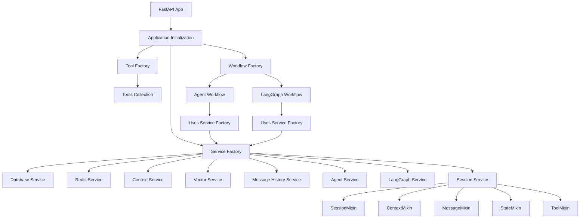
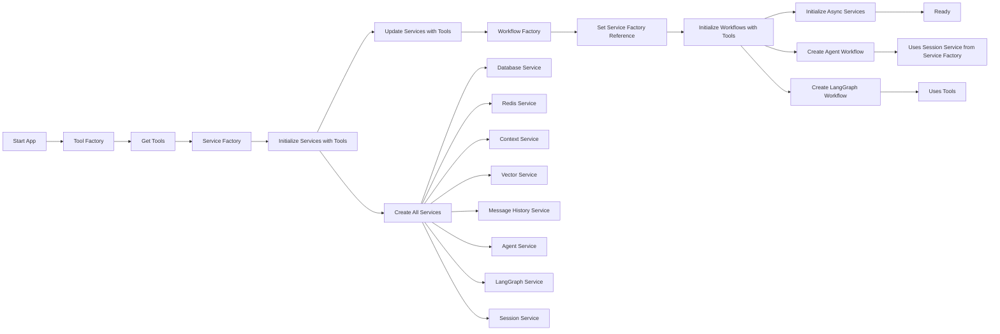
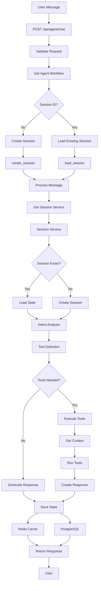
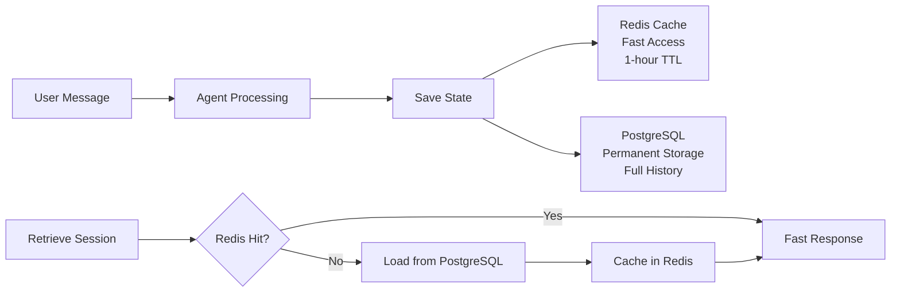

# Agent with Context

A powerful AI agent system built with render_relay framework, featuring Redis state management, PostgreSQL + pgvector for context storage, Google Gemini LLM integration via LangChain, and Pydantic models.

## Features

- 🤖 **AI Agent Conversations** - Stateful conversations with LLM integration
- 🗄️ **Redis State Management** - Fast session access with write-through persistence
- 🧠 **Vector Database Context** - PostgreSQL + pgvector for semantic context storage
- 🔧 **Gemini LLM Integration** - Google's Gemini model via LangChain with Pydantic
- 📊 **Health Monitoring** - Service health checks and diagnostics
- 🚀 **render_relay Framework** - FastAPI + React
- 🔄 **Alembic Migrations** - Version-controlled database schema management
- 🏭 **Factory Pattern Architecture** - Clean dependency injection and service management
- 🧩 **Service Mixins** - Modular service composition for maintainability

## Quick Start

### 1. Environment Setup

Create a `.env` file with your configuration:

```bash
# Redis Configuration
REDIS_URL=redis://localhost:6379

# PostgreSQL + pgvector Configuration
POSTGRES_HOST=localhost
POSTGRES_PORT=5432
POSTGRES_USER=agent_user
POSTGRES_PASSWORD=agent_password
POSTGRES_DB=agent_context

# Gemini Configuration
GEMINI_API_KEY=your_gemini_api_key_here

# Optional: Customize settings
GEMINI_MODEL=gemini-2.5-flash-lite
GEMINI_TEMPERATURE=0.7
MAX_CONTEXT_LENGTH=2048
CONTEXT_CHUNK_SIZE=1000
CONTEXT_CHUNK_OVERLAP=200
```

### 2. Start Services

```bash
# Start Redis and PostgreSQL with pgvector
docker-compose up -d

# Install dependencies
pip install -r requirements.txt

# Apply database migrations
alembic upgrade head

# Start the application
npm run dev
```

### 3. Test the System

#### Health Check
```bash
curl http://localhost:5001/api/health
```

#### Create Agent Session
```bash
curl -X POST http://localhost:5001/api/agent \
  -H "Content-Type: application/json" \
  -d '{"initial_message": "Hello, I need help with a project"}'
```

#### Send Message to Agent
```bash
curl -X POST http://localhost:5001/api/agent/chat \
  -H "Content-Type: application/json" \
  -d '{"session_id": "your-session-id", "message": "Can you help me with Python?"}'
```

#### List Available Tools
```bash
curl http://localhost:5001/api/mcp_tools
```

#### Execute Tool Directly
```bash
curl -X POST http://localhost:5001/api/mcp_tools \
  -H "Content-Type: application/json" \
  -d '{"tool_name": "get_current_datetime", "parameters": {}}'
```

## How the Agent Works

### Architecture Overview

The system uses a sophisticated factory pattern with dependency injection and service mixins:



### Agent Workflow & Processing

The agent follows a sophisticated multi-layered workflow:

#### 1. Application Initialization


#### 2. Message Processing Flow


### Detailed Agent Processing Steps

#### 1. **Request Reception & Validation**
- FastAPI receives HTTP request
- Validates request format and session ID
- Routes to appropriate workflow handler

#### 2. **Session State Management**
- **Session Service** (using mixins):
  - **SessionMixin**: Manages session lifecycle
  - **StateMixin**: Handles Redis/PostgreSQL state
  - **MessageMixin**: Manages conversation history
  - **ContextMixin**: Handles context storage
  - **ToolMixin**: Manages tool interactions

#### 3. **Intent Analysis & Tool Selection**
- **LangGraph Workflow Service**:
  - Analyzes user message for intent
  - Determines required tools based on intent
  - Selects appropriate tools from available collection

#### 4. **Context Retrieval & Tool Execution**
- **Context Tool**: Searches vector database for relevant context
- **Other Tools**: Execute based on user request
- **Tool Results**: Collected and formatted for LLM

#### 5. **Response Generation**
- **Agent Service**: Uses LangChain agent with tools
- **LLM Integration**: Google Gemini processes request with context
- **Response Formatting**: Structured response with tool usage info

#### 6. **State Persistence**
- **Write-Through Strategy**:
  - **Redis**: Fast cache with 1-hour TTL
  - **PostgreSQL**: Permanent storage with full history
  - **Automatic Sync**: All updates go to both systems

### Service Architecture

#### Factory Pattern Implementation

```python
# Service Factory - Manages all service dependencies
class ServiceFactory:
    - DatabaseService
    - RedisService  
    - ContextService
    - VectorService
    - MessageHistoryService
    - AgentService
    - LangGraphService
    - SessionService (unified)

# Workflow Factory - Manages workflow dependencies
class WorkflowFactory:
    - AgentWorkflow
    - LangGraphWorkflowService

# Tool Factory - Manages available tools
class ToolFactory:
    - get_current_datetime
    - get_weather
    - check_system_health
    - calculate
    - retrieve_session_context
    - execute_terminal_command
    - list_safe_commands
    - get_command_help
```

#### Service Mixin Architecture

The **SessionService** uses a mixin pattern for modular functionality:

```python
class SessionService(SessionMixin, ContextMixin, MessageMixin, StateMixin, ToolMixin):
    """
    Unified service combining all session-related operations:
    
    - SessionMixin: Session lifecycle management
    - ContextMixin: Context storage and retrieval
    - MessageMixin: Message history management
    - StateMixin: Redis/PostgreSQL state handling
    - ToolMixin: Tool execution and management
    """
```

### Data Flow Architecture

#### Write-Through Data Strategy



**Key Benefits:**
- **Redis**: Sub-millisecond access for active sessions
- **PostgreSQL**: ACID compliance and data integrity
- **Automatic Fallback**: Redis miss → PostgreSQL → Redis cache
- **No Data Loss**: All conversations permanently stored

### Tool System

#### Available Tools

The agent has access to several specialized tools:

1. **Context Tools**:
   - `retrieve_session_context`: Semantic search for relevant context

2. **Utility Tools**:
   - `get_current_datetime`: Get current date/time
   - `calculate`: Mathematical calculations
   - `get_weather`: Weather information

3. **System Tools**:
   - `check_system_health`: System diagnostics

#### Tool Selection Logic

Tools are automatically selected based on:
- **Intent Analysis**: LLM determines user intent
- **Tool Requirements**: Intent maps to required tools
- **Context Relevance**: Tools that need context are prioritized
- **Safety Checks**: Terminal commands are validated

### Context Management

#### Vector Database Integration

The system uses PostgreSQL + pgvector for semantic context storage:

- **Semantic Search**: Context retrieved based on meaning, not keywords
- **File Chunking**: Large documents automatically split
- **Embedding Storage**: Google's embedding-001 model
- **Session Isolation**: Each session has independent context space

#### Context Types Supported

- **Text Context**: Simple text information
- **File Content**: Uploaded documents (PDF, DOCX, TXT)
- **Structured Data**: JSON objects and metadata
- **List Items**: Collections of related information

### Configuration Management

The system uses a centralized configuration system:

```python
class Config:
    # Redis Configuration
    REDIS_URL: str
    
    # PostgreSQL + pgvector Configuration
    POSTGRES_HOST: str
    POSTGRES_PORT: int
    POSTGRES_USER: str
    POSTGRES_PASSWORD: str
    POSTGRES_DB: str
    
    # Gemini Configuration
    GEMINI_API_KEY: str
    GEMINI_MODEL: str
    GEMINI_TEMPERATURE: float
    
    # Agent Configuration
    MAX_CONTEXT_LENGTH: int
    AGENT_STATE_TTL: int
    
    # Vector Database Configuration
    EMBEDDING_MODEL: str
    MAX_CONTEXT_CHUNKS: int
    CONTEXT_CHUNK_SIZE: int
    CONTEXT_CHUNK_OVERLAP: int
    
    # Limits Configuration
    DEFAULT_MESSAGE_LIMIT: int
    MAX_MESSAGE_LIMIT: int
    DEFAULT_CONTEXT_LIMIT: int
    MAX_CONTEXT_LIMIT: int
    CONTEXT_SEARCH_LIMIT: int
    CONTEXT_SIMILARITY_THRESHOLD: float
```

## API Endpoints

### Core Agent Endpoints

- `GET /api/health` - System health check
- `GET /api/agent/sessions` - List all sessions
- `POST /api/agent` - Create new session
- `GET /api/agent` - Get session information
- `POST /api/agent/chat` - Send message to agent
- `GET /api/agent/chat` - Get chat messages
- `GET /api/agent/context` - Get session context
- `PUT /api/agent/context` - Add context to session

### Tool Management

- `GET /api/mcp_tools` - List available tools
- `POST /api/mcp_tools` - Execute tool directly


## Database Migrations

This project uses Alembic for database migrations.

### Initial Setup
```bash
# Initialize Alembic (first time only)
python scripts/migrate.py init

# Apply all migrations
python scripts/migrate.py upgrade
```

### Development Workflow
```bash
# Create a new migration after model changes
python scripts/migrate.py create "Add new feature"

# Apply migrations
python scripts/migrate.py upgrade

# Rollback last migration
python scripts/migrate.py downgrade

# Check current migration
python scripts/migrate.py current

# View migration history
python scripts/migrate.py history
```

## Adding Tools to the Agent

### Tool Development Guide

Tools extend the agent's capabilities and are automatically selected based on user intent.

#### 1. Create a New Tool

Create a new file in `app/tools/`:

```python
# app/tools/my_tool.py
from langchain_core.tools import tool
from render_relay.utils.get_logger import get_logger

logger = get_logger("my_tool")

@tool
def my_tool_function(input_param: str) -> str:
    """
    Description of what this tool does.
    
    Args:
        input_param: Description of the input parameter
        
    Returns:
        Description of what the tool returns
    """
    try:
        # Your tool logic here
        result = f"Processed: {input_param}"
        logger.info(f"Tool executed successfully: {result}")
        return result
    except Exception as e:
        logger.error(f"Tool execution failed: {e}")
        return f"Error: {str(e)}"
```

#### 2. Register the Tool

Add your tool to `app/factory/tool_factory.py`:

```python
from ..tools.my_tool import my_tool_function

class ToolFactory:
    def __init__(self):
        self.tools = [
            # ... existing tools ...
            my_tool_function,
        ]
```

#### 3. Tool Best Practices

- **Clear Descriptions**: Help LLM understand when to use the tool
- **Error Handling**: Always handle exceptions gracefully
- **Logging**: Use structured logging for debugging
- **Type Hints**: Use proper type annotations
- **Safety**: Validate inputs and outputs

## Architecture Benefits

### Factory Pattern Benefits
- **Dependency Injection**: Clean service management
- **Testability**: Easy to mock and test components
- **Maintainability**: Clear separation of concerns
- **Scalability**: Easy to add new services and tools

### Service Mixin Benefits
- **Modularity**: Reusable service components
- **Composition**: Combine functionality as needed
- **Maintainability**: Isolated functionality
- **Flexibility**: Easy to extend and modify

### Write-Through Architecture Benefits
- **Performance**: Fast Redis access for active sessions
- **Reliability**: PostgreSQL ensures data safety
- **Scalability**: TTL prevents memory bloat
- **Recovery**: Automatic system recovery

## Development

### Project Structure
```
agent_with_context/
├── app/
│   ├── config/           # Configuration management
│   ├── db/              # Database models and repositories
│   ├── factory/         # Factory pattern implementations
│   ├── services/        # Business logic services
│   │   └── mixins/      # Service mixins for modularity
│   ├── tools/           # Agent tools
│   ├── workflow/        # Workflow management
│   ├── initialize.py    # Application initialization
│   └── main.py          # FastAPI application
├── src/                 # Frontend React components and api endpoints
├── scripts/             # Utility scripts
├── migrations/          # Database migrations
└── requirements.txt     # Python dependencies
```

### Key Components

1. **Factory Pattern**: Manages service dependencies and initialization
2. **Service Mixins**: Modular service composition
3. **Workflow Management**: Orchestrates agent behavior
4. **Tool System**: Extensible functionality
5. **Context Management**: Vector database integration
6. **State Management**: Redis/PostgreSQL hybrid

### Monitoring & Debugging

- **Health Checks**: `/api/health` for system status
- **Logging**: Structured logging throughout the system
- **Performance**: Timing information in logs
- **Error Handling**: Graceful error recovery

## FAQ

### General Questions

**Q: How does the agent maintain conversation context?**
A: The agent uses a write-through strategy with Redis for fast access and PostgreSQL for persistence. Every message is saved to both systems, ensuring no data loss while maintaining performance.

**Q: What happens if Redis goes down?**
A: The system automatically falls back to PostgreSQL to retrieve session data. Once Redis is restored, the data is cached back for fast access.

**Q: How long are conversations stored?**
A: Conversations are permanently stored in PostgreSQL. Redis has a 1-hour TTL for active sessions, but all data is safely persisted.

### Tool Development

**Q: How do I add a new tool to the agent?**
A: Create a new Python file in the `app/tools/` directory, implement the tool logic, and register it in `app/factory/tool_factory.py`. The agent will automatically select tools based on user intent.

**Q: Can tools access the conversation history?**
A: Yes, tools can access the current conversation context and session data through the workflow state.

**Q: How are tools selected for each request?**
A: The LLM analyzes user intent and selects relevant tools. Tools can also be configured to run automatically based on specific conditions.

### Database & Migrations

**Q: How do I add a new database table?**
A: Create a new model in `app/db/models/`, then run `python scripts/migrate.py create "Add new table"` to generate a migration.

**Q: Can I rollback database changes?**
A: Yes, use `python scripts/migrate.py downgrade` to rollback the last migration, or `alembic downgrade <revision_id>` for specific revisions.

**Q: What's the difference between Redis and PostgreSQL storage?**
A: Redis provides fast, temporary storage for active sessions, while PostgreSQL provides permanent, persistent storage for all conversations and context.

### Context & Files

**Q: How are files processed and stored?**
A: Files are chunked into smaller pieces, converted to embeddings using embedding model, and stored in PostgreSQL with pgvector for semantic search.

**Q: Can I upload multiple file types?**
A: Yes, the system supports various file types including PDF, DOCX, TXT, and more. Files are processed and stored as searchable context.

**Q: How is context retrieved during conversations?**
A: The system uses semantic search to find relevant context based on the user's message, retrieving the most similar content from the vector database.

### Performance & Scaling

**Q: How many concurrent sessions can the system handle?**
A: The system is designed to handle hundreds of concurrent sessions, with Redis providing fast access and PostgreSQL handling persistence.

**Q: What's the maximum file size for uploads?**
A: File size limits are configurable, but large files are automatically chunked for efficient processing and storage.

**Q: How can I optimize performance?**
A: Monitor Redis hit rates, optimize database queries, and adjust chunking parameters based on your use case.

### Troubleshooting

**Q: Migrations are failing. What do I do?**
A: Check the migration history with `python scripts/migrate.py history`, ensure your database is running, and verify the connection settings in your `.env` file.


### Integration & Deployment


**Q: How do I integrate this with my existing system?**
A: The system provides RESTful APIs that can be easily integrated with any frontend or backend system.

**Q: Can I use a different LLM provider?**
A: Yes, the system is designed to be LLM-agnostic. You can modify the configuration to use different providers like OpenAI, Anthropic, or others. 

